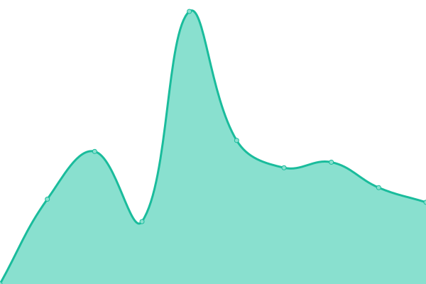

# [📈 Live Status](https://stoamandl.github.io/upptime): <!--live status--> **🟥 Complete outage**

This repository contains the open-source uptime monitor and status page for [Jan](https://stoamandl.github.io/upptime), powered by [Upptime](https://github.com/upptime/upptime).

With [Upptime](https://upptime.js.org), you can get your own unlimited and free uptime monitor and status page, powered entirely by a GitHub repository. We use [Issues](https://github.com/stoamandl/upptime/issues) as incident reports, [Actions](https://github.com/stoamandl/upptime/actions) as uptime monitors, and [Pages](https://stoamandl.github.io/upptime) for the status page.

<!--start: status pages-->
<!-- This summary is generated by Upptime (https://github.com/upptime/upptime) -->
<!-- Do not edit this manually, your changes will be overwritten -->
<!-- prettier-ignore -->
| URL | Status | History | Response Time | Uptime |
| --- | ------ | ------- | ------------- | ------ |
|  [binaryfour](https://binaryfour.de) | 🟥 Down | [binaryfour.yml](https://github.com/stoamandl/upptime/commits/HEAD/history/binaryfour.yml) | 

 768ms
     
 | 

<a href="https://stoamandl.github.io/upptime/history/binaryfour">98.94%</a>
    

|  [Cloud binaryfour](https://cloud.binaryfour.de) | 🟥 Down | [cloud-binaryfour.yml](https://github.com/stoamandl/upptime/commits/HEAD/history/cloud-binaryfour.yml) | 

 960ms
     
 | 

<a href="https://stoamandl.github.io/upptime/history/cloud-binaryfour">98.95%</a>
    

|  [Zweiradwerke](https://zweiradwerke.de) | 🟥 Down | [zweiradwerke.yml](https://github.com/stoamandl/upptime/commits/HEAD/history/zweiradwerke.yml) | 

 1340ms
     
 | 

<a href="https://stoamandl.github.io/upptime/history/zweiradwerke">98.83%</a>
    

|  [Cloud Zweiradwerke](https://cloud.zweiradwerke.de) | 🟥 Down | [cloud-zweiradwerke.yml](https://github.com/stoamandl/upptime/commits/HEAD/history/cloud-zweiradwerke.yml) | 

 914ms
     
 | 

<a href="https://stoamandl.github.io/upptime/history/cloud-zweiradwerke">98.98%</a>
    

|  [Wolf Ingenieurbüro](https://wolf-ingenieurbuero.de) | 🟥 Down | [wolf-ingenieurbuero.yml](https://github.com/stoamandl/upptime/commits/HEAD/history/wolf-ingenieurbuero.yml) | 

 2015ms
     
 | 

<a href="https://stoamandl.github.io/upptime/history/wolf-ingenieurbuero">98.87%</a>
    

<!--end: status pages-->

[**Visit our status website →**](https://stoamandl.github.io/upptime)

## 📄 License

- Powered by: [Upptime](https://github.com/upptime/upptime)
- Code: [MIT](./LICENSE) © [Jan](https://stoamandl.github.io/upptime)
- Data in the `./history` directory: [Open Database License](https://opendatacommons.org/licenses/odbl/1-0/)
